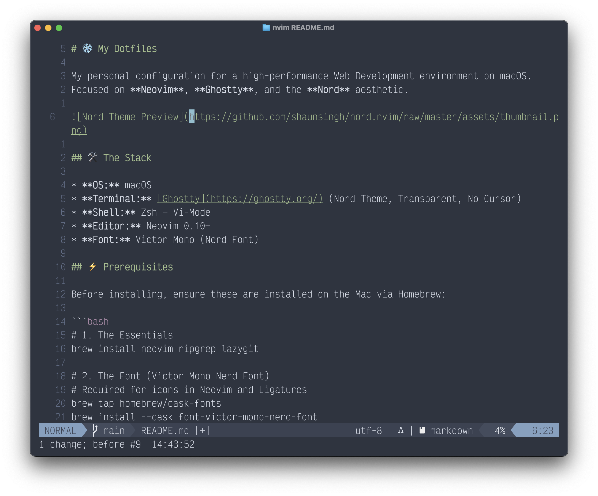

# ❄️ Dotfiles

My personal configuration for a high-performance Web Development environment on macOS.
Focused on **Neovim**, **Ghostty**, and the **Nord** aesthetic.



## 🛠 The Stack

- **OS:** macOS
- **Terminal:** [Ghostty](https://ghostty.org/) ([Nord Theme](https://www.nordtheme.com/), [Starship Prompt](https://starship.rs/))
- **Shell:** Zsh + Vi-Mode
- **Editor:** [Neovim](https://neovim.io/) 0.10+
- **Font:** [Victor Mono](https://rubjo.github.io/victor-mono/) ([Nerd Font](https://www.nerdfonts.com/font-downloads))
- **Git:** [LazyGit](https://github.com/jesseduffield/lazygit)
- **Container:** [OrbStack](https://orbstack.dev/)

## 🚀 Installation

### 1. Clone the Repo

Clone this repository to your development folder:

```bash
# Create the directory
mkdir -p ~/dev

# Clone
git clone [https://github.com/kromar1/dotfiles.git](https://github.com/kromar1/dotfiles.git) ~/dev/dotfiles
```

### 2. Run the Setup Script

This script will automatically:

1. Install Homebrew (if missing).
2. Install all dependencies (Neovim, Docker, Fonts, Node, etc.) via `Brewfile`.
3. Set common macOS defaults using (./scripts/macos-defaults.sh)
4. Symlink the new configs.

```bash
cd ~/dev/dotfiles
chmod +x setup.sh
./setup.sh
```

---

## 🎹 Keybinding Cheat Sheet

**Leader Key:** `<Space>`

### 📂 File Navigation

| Key         | Action                     | Plugin        |
| :---------- | :------------------------- | :------------ |
| `<Space>e`  | Toggle File Tree Sidebar   | **Neo-tree**  |
| `<Space>ff` | Find Files (Fuzzy)         | **Telescope** |
| `<Space>fg` | Live Grep (Search Text)    | **Telescope** |
| `<Space>fb` | Find Open Buffers          | **Telescope** |
| `<Space>fp` | Clipboard/Register History | **Telescope** |

### ⚡️ Harpoon (Quick Nav)

| Key        | Action                       |
| :--------- | :--------------------------- |
| `<Space>a` | **Add** file to Harpoon list |
| `<Space>h` | Toggle Harpoon **Menu**      |
| `<Space>1` | Go to File 1                 |
| `<Space>2` | Go to File 2                 |
| `<Space>3` | Go to File 3                 |
| `<Space>4` | Go to File 4                 |

### 🧠 LSP & Coding (Intellisense)

| Key         | Action                  | Note                              |
| :---------- | :---------------------- | :-------------------------------- |
| `K`         | **Hover** Documentation | (Shift + k)                       |
| `gd`        | Go to **Definition**    | Jumps to source                   |
| `<Space>rn` | Smart **Rename**        | Renames variable usage everywhere |
| `<Space>ca` | **Code Action**         | Quick fix / Imports / Refactor    |
| `<Space>d`  | Show **Diagnostics**    | Show error/hint message in float  |
| `[d` / `]d` | Prev / Next Error       | Jump between errors               |

### 🪟 Window & Buffer Management

| Key        | Action              |
| :--------- | :------------------ |
| `Ctrl + h` | Focus Left Window   |
| `Ctrl + l` | Focus Right Window  |
| `Ctrl + j` | Focus Down Window   |
| `Ctrl + k` | Focus Up Window     |
| `Alt + j`  | Move Line Down      |
| `Alt + k`  | Move Line Up        |
| `Ctrl + \` | Toggle **Terminal** |

### 🌲 LazyGit

| Key         | Action           |                 |
| :---------- | :--------------- | :-------------- |
| `<Space>gg` | Open **Lazygit** | Floating window |

###  Markdown Preview

| Key                | Action                          |
| :----------------- | :------------------------------ |
| `:MarkdownPreview` | Render Markdown of current file |

---

## 📂 Structure

```text
dotfiles
├── assets
│   └── preview.png                 # Nord theme preview (nvim)
├── ghostty                         # Terminal Config
│   └── config                      # Theme, Font, & Opacity settings
├── git
│   └── gitconfig
├── lazygit
│   └── config.yml
├── nvim                            # Neovim Config
│   ├── lua
│   │   ├── config                  # Options (vim.opt) & Keymaps
│   │   │   └── lazy.lua
│   │   └── plugins                 # Lazy.nvim plugin specs
│   │       ├── conform.lua
│   │       ├── dressing.lua
│   │       ├── harpoon.lua
│   │       ├── lazygit.lua
│   │       ├── lualine.lua
│   │       ├── markdown-preview.lua
│   │       ├── neo-tree.lua
│   │       ├── nord.lua
│   │       ├── nvim-cmp.lua
│   │       ├── nvim-lspconfig.lua
│   │       ├── telescope.lua
│   │       └── treesitter.lua
│   ├── init.lua                    # Entry point (Leader key setup)
│   └── lazy-lock.json
├── zsh
│   └── zshrc
├── Brewfile                        # List of Homebrew packages
├── README.md                       # This file
└── setup.sh                        # Installation script
```
