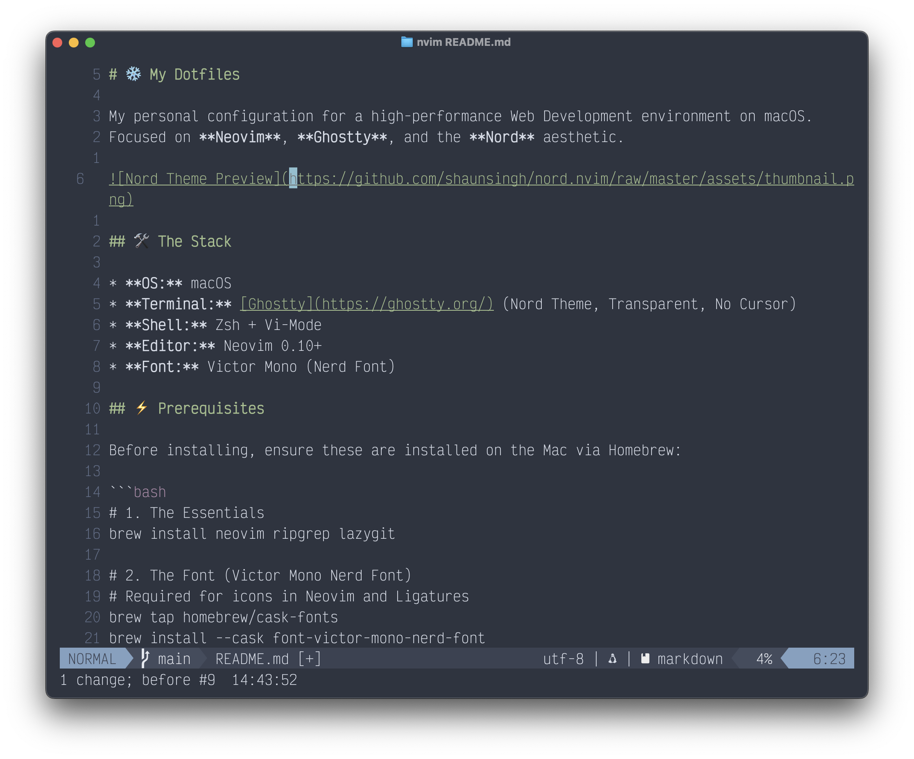

# ❄️ My Dotfiles

My personal configuration for a high-performance Web Development environment on macOS.
Focused on **Neovim**, **Ghostty**, and the **Nord** aesthetic.



## 🛠 The Stack

- **OS:** macOS
- **Terminal:** [Ghostty](https://ghostty.org/) (Nord Theme, Transparent, No Cursor)
- **Shell:** Zsh + Vi-Mode
- **Editor:** Neovim 0.10+
- **Font:** Victor Mono (Nerd Font)

## ⚡️ Prerequisites

Before installing, ensure these are installed on the Mac via Homebrew:

```bash
# 1. The Essentials
brew install neovim ripgrep lazygit

# 2. The Font (Victor Mono Nerd Font)
# Required for icons in Neovim and Ligatures
brew tap homebrew/cask-fonts
brew install --cask font-victor-mono-nerd-font
```

## 🚀 Installation

### 1. Clone the Repo

Clone this repository to your home directory:

```bash
git clone [https://github.com/kromar1/dotfiles.git](https://github.com/kromar1/dotfiles.git) ~/dotfiles
```

### 2. Symlink Configs

Create symbolic links to map the repository files to your system configuration locations. This allows you to edit files in `~/dotfiles` and see changes instantly.

```bash
# Link Neovim
ln -s ~/dev/dotfiles/nvim ~/.config/nvim

# Link Ghostty
ln -s ~/dev/dotfiles/ghostty ~/.config/ghostty

# Link Zsh
# ln -s ~/dev/dotfiles/zshrc ~/.zshrc
```

---

## 🎹 Keybinding Cheat Sheet

**Leader Key:** `<Space>`

### 📂 File Navigation

| Key         | Action                     | Plugin        |
| :---------- | :------------------------- | :------------ |
| `<Space>e`  | Toggle File Tree Sidebar   | **Neo-tree**  |
| `<Space>ff` | Find Files (Fuzzy)         | **Telescope** |
| `<Space>fg` | Live Grep (Search Text)    | **Telescope** |
| `<Space>fb` | Find Open Buffers          | **Telescope** |
| `<Space>fp` | Clipboard/Register History | **Telescope** |

### ⚡️ Harpoon (Quick Nav)

| Key        | Action                       |
| :--------- | :--------------------------- |
| `<Space>a` | **Add** file to Harpoon list |
| `<Space>h` | Toggle Harpoon **Menu**      |
| `<Space>1` | Go to File 1                 |
| `<Space>2` | Go to File 2                 |
| `<Space>3` | Go to File 3                 |
| `<Space>4` | Go to File 4                 |

### 🧠 LSP & Coding (Intellisense)

| Key         | Action                  | Note                              |
| :---------- | :---------------------- | :-------------------------------- |
| `K`         | **Hover** Documentation | (Shift + k)                       |
| `gd`        | Go to **Definition**    | Jumps to source                   |
| `<Space>rn` | Smart **Rename**        | Renames variable usage everywhere |
| `<Space>ca` | **Code Action**         | Quick fix / Imports / Refactor    |
| `<Space>d`  | Show **Diagnostics**    | Show error/hint message in float  |
| `[d` / `]d` | Prev / Next Error       | Jump between errors               |

### 🪟 Window & Buffer Management

| Key        | Action              |
| :--------- | :------------------ |
| `Ctrl + h` | Focus Left Window   |
| `Ctrl + l` | Focus Right Window  |
| `Ctrl + j` | Focus Down Window   |
| `Ctrl + k` | Focus Up Window     |
| `Alt + j`  | Move Line Down      |
| `Alt + k`  | Move Line Up        |
| `Ctrl + \` | Toggle **Terminal** |

### 🌲 Git

| Key         | Action           |
| :---------- | :--------------- | --------------- |
| `<Space>gg` | Open **Lazygit** | Floating window |

---

## 📂 Structure

```text
~/dotfiles
├── assets/
│   └── preview.png   # Nord theme preview (nvim)
├── ghostty/          # Terminal Config
│   └── config        # Theme, Font, & Opacity settings
├── nvim/             # Neovim Config
│   ├── init.lua      # Entry point (Leader key setup)
│   └── lua/
│       ├── config/   # Options (vim.opt) & Keymaps
│       └── plugins/  # Lazy.nvim plugin specs
├── README.md
└── zshrc             # zsh config
```
